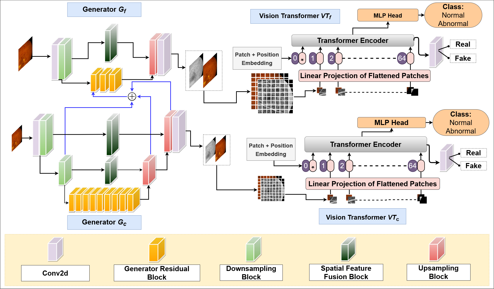

# VTGAN

[](https://paperswithcode.com/sota/fundus-to-angiography-generation-on-fundus?p=vtgan-semi-supervised-retinal-image-synthesis)

This code is for our paper "VTGAN: Semi-supervised Retinal Image Synthesis and Disease Prediction using Vision Transformers" which is part of the supplementary materials for ICCV 2021 Workshop on Computer Vision for Automated Medical Diagnosis. The paper has since been accpeted to ICCV 2021 Workshop and will be presented in October 2021.




### Arxiv Pre-print
```
https://arxiv.org/abs/2104.06757
```
# Citation 
```
@misc{kamran2021vtgan,
    title={VTGAN: Semi-supervised Retinal Image Synthesis and Disease Prediction using Vision Transformers},
    author={Sharif Amit Kamran and Khondker Fariha Hossain and Alireza Tavakkoli and Stewart Lee Zuckerbrod and Salah A. Baker},
    year={2021},
    eprint={2104.06757},
    archivePrefix={arXiv},
    primaryClass={eess.IV}
}
```


## Work in Progress
